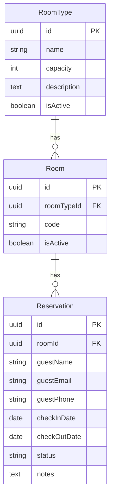

# Backend Blueprint — Hotel (NestJS + TypeORM + nestjs-paginate)

Dokumentasi backend sekarang dipisah **per modul**. Gunakan dokumen index BE ini untuk navigasi.

- Index modul BE: [`be/README.md`](./be/README.md)

## Stack

- NestJS
- TypeORM
- `nestjs-paginate`
- DB: Postgres (disarankan) / SQLite (dev cepat)
- Validasi: `class-validator`, `class-transformer`

## Bootstrap

- Scaffold di `apps/api` dengan TypeScript strict.
- Env: `DATABASE_URL` (atau host/port/user/pass/db terpisah).

## Konvensi penting

- **Base path**: `/v1`
- **Format tanggal reservation**: `YYYY-MM-DD` (bukan datetime) untuk MVP.
- **Status reservation**: `PENDING | CONFIRMED | CANCELLED`
- **Document numbering** (human-friendly): gunakan `...Number` seperti `reservationNumber` (`RSV-YYYY-000001`), sementara `id` (uuid) tetap untuk internal.

## Domain (MVP)

Fokus **hotel** (non-generic). Booking menjadi **reservation** dengan konsep **check-in / check-out**.

## Model data (MVP Hotel)

| Entitas | Peran |
|---|---|
| `RoomType` | Tipe kamar (nama, kapasitas, deskripsi) untuk grouping & filter. |
| `Room` | Kamar fisik (nomor/kode kamar), relasi ke `RoomType`, aktif/nonaktif. |
| `Reservation` | Reservasi satu kamar (`roomId`) untuk rentang tanggal check-in/out + data tamu + status. |

## Aturan bisnis

- **Tanggal:** `checkInDate < checkOutDate` (format ISO `YYYY-MM-DD`).
- **Bentrok reservasi:** untuk `roomId` yang sama, reservasi overlap bila:  
  `checkInDate < other.checkOutDate && other.checkInDate < checkOutDate`  
  dengan pengecualian status `CANCELLED`.
- Index DB disarankan pada `(roomId, checkInDate, checkOutDate)` untuk query overlap.

## Modul Nest

- `RoomTypesModule`: lihat [`be/room-types.md`](./be/room-types.md)
- `RoomsModule`: lihat [`be/rooms.md`](./be/rooms.md)
- `ReservationsModule`: lihat [`be/reservations.md`](./be/reservations.md)
- Calendar endpoint: lihat [`be/calendar.md`](./be/calendar.md)
- Future modules (payment not included yet):
  - Customers: [`be/customers.md`](./be/customers.md)
  - Charges: [`be/charges.md`](./be/charges.md)
  - Invoices: [`be/invoices.md`](./be/invoices.md)
- Pricing:
  - nightly rates: [`be/rates.md`](./be/rates.md)
  - promotions: [`be/promotions.md`](./be/promotions.md)
  - taxes: [`be/taxes.md`](./be/taxes.md)
  - calculation: [`be/pricing-calculation.md`](./be/pricing-calculation.md)

## API surface (REST)

- `GET/POST /room-types`, `GET/PATCH/DELETE /room-types/:id`
- `GET/POST /rooms`, `GET/PATCH/DELETE /rooms/:id`
- `GET/POST /reservations`, `GET/PATCH/DELETE /reservations/:id`
- `GET /reservations/calendar?from=&to=&roomId=` (event-style JSON)

Konsistensi:

- Validasi DTO + exception filter konsisten (400 jelas; bentrok sesuai kebijakan, mis. 409).

## Auth (MVP)

- Opsi A: tanpa auth (internal/demo).
- Opsi B: JWT + satu role admin (setelah CRUD stabil).

## Catatan operasional

- `.env.example` untuk API.
- README: cara migrasi/sync schema, dan port API.
