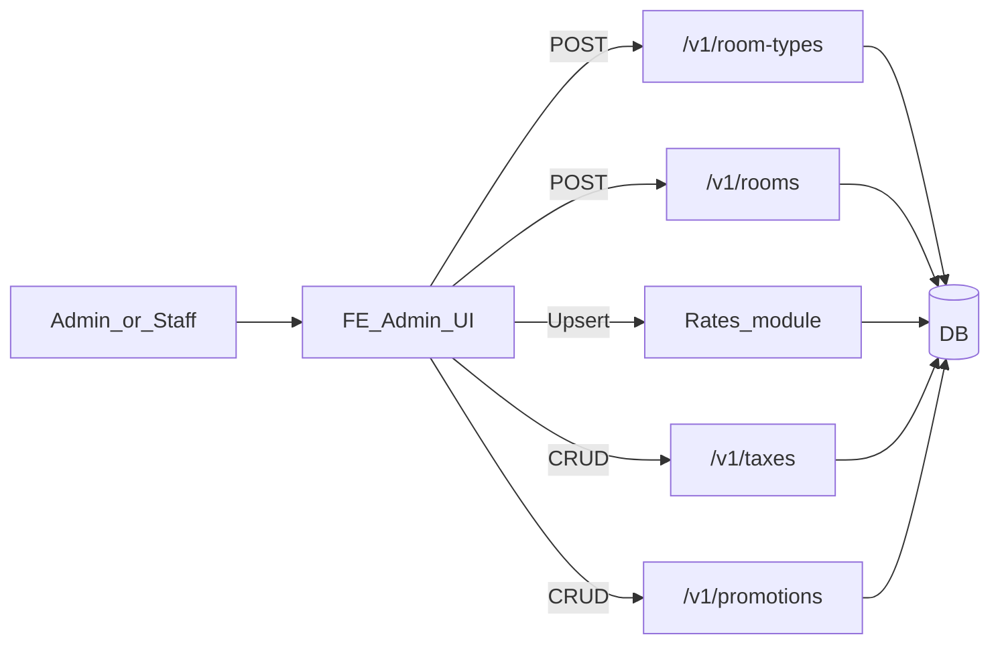
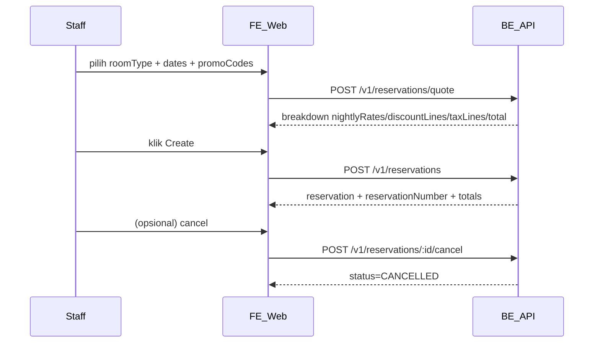
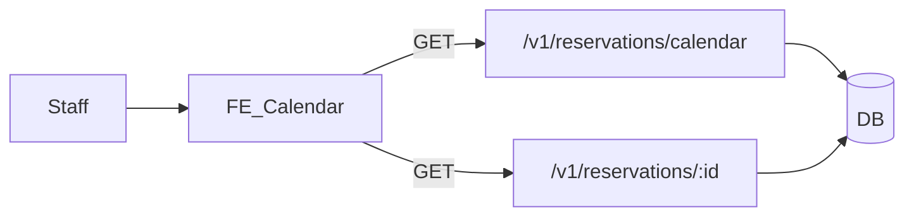
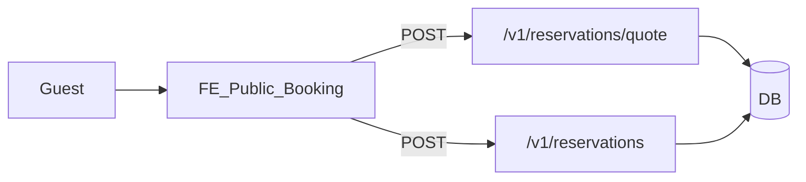
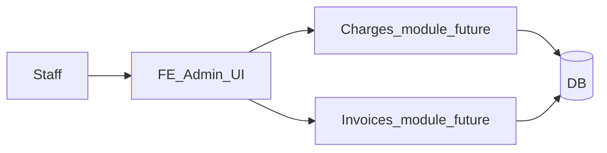

# Flow Aplikasi — MVP Hotel

Dokumen ini menjelaskan flow end-to-end aplikasi (MVP) supaya implementasi FE/BE konsisten.

## Konvensi

- Reservation memakai `checkInDate` / `checkOutDate` format `YYYY-MM-DD`.
- Pricing mengikuti Policy A (lihat [`be/pricing-calculation.md`](./be/pricing-calculation.md)).
- Payment **belum ada** di scope.

---

## 1) AdminSetup

**Tujuan**: admin menyiapkan data master agar reservation bisa dibuat dan dihitung biayanya.

**Aktor**: Admin/Staff internal.

**Preconditions**:

- Room types belum ada / belum lengkap.

**Happy path**:

1. Buat `RoomType` (nama, kapasitas, aktif).
2. Buat `Room` untuk `RoomType` tersebut (kode kamar).
3. Atur nightly rate per tanggal (seasonal/weekday).
4. Atur taxes yang berlaku (bisa beberapa tax aktif).
5. Atur promotions (CODE/AUTO) beserta constraints.

**Endpoints yang dipakai**:

- Room types: `POST /v1/room-types`, `GET /v1/room-types`
- Rooms: `POST /v1/rooms`, `GET /v1/rooms`
- Rates: `GET /v1/rates?roomTypeId&from&to` (+ modul create/update rate saat nanti dibuat)
- Taxes: CRUD `/v1/taxes`
- Promotions: CRUD `/v1/promotions`

**Edge cases**:

- Room dinonaktifkan (`isActive=false`) → tidak bisa dipakai booking baru (kebijakan implementasi).
- Taxes berubah tanggal berlaku → gunakan selection rule yang terdokumentasi di [`be/taxes.md`](./be/taxes.md).

---

## 2) StaffReservationFlow

**Tujuan**: staff membuat reservation, melihat breakdown harga, dan bisa cancel.

**Aktor**: Staff.

**Preconditions**:

- RoomType, Room, rates, taxes sudah ada.

**Happy path**:

1. Staff memilih `roomType` dan tanggal `checkInDate`/`checkOutDate`.
2. Staff mengisi `promoCodes[]` (opsional).
3. FE meminta quote untuk menampilkan breakdown.
4. Jika setuju, FE create reservation.
5. Setelah dibuat, staff bisa:
   - update non-jadwal (mis. `notes`)
   - cancel reservation

**Endpoints yang dipakai**:

- Quote: `POST /v1/reservations/quote`
- Create: `POST /v1/reservations`
- Update: `PATCH /v1/reservations/:id`
- Cancel: `POST /v1/reservations/:id/cancel`
- List/detail: `GET /v1/reservations`, `GET /v1/reservations/:id`

**Edge cases**:

- **Overlap** (bentrok tanggal untuk room yang sama) → BE 409.
- Promo invalid/konflik stacking → BE 400/409 sesuai policy promo.
- Setelah `CANCELLED`, FE disable perubahan `roomId/checkInDate/checkOutDate`, hanya boleh edit `notes`.

---

## 3) CalendarOps

**Tujuan**: operasional melihat jadwal/occupancy dalam bentuk kalender.

**Aktor**: Staff.

**Preconditions**:

- Reservation sudah ada.

**Happy path**:

1. Staff membuka kalender dan memilih rentang `from/to`.
2. FE memanggil endpoint calendar.
3. Staff filter per room/room type (bisa FE-side atau query param).
4. Klik event untuk membuka detail reservation.

**Endpoints yang dipakai**:

- Calendar: `GET /v1/reservations/calendar?from=&to=&roomId=`
- Detail: `GET /v1/reservations/:id`

**Edge cases**:

- Jika event reservation `CANCELLED`, FE bisa sembunyikan atau tampilkan beda warna.

---

## 4) GuestOnlineBooking (tanpa payment)

**Tujuan**: tamu dapat melakukan booking online tanpa payment (sementara), minimal mendapat nomor reservasi.

**Aktor**: Guest (publik).

**Preconditions**:

- Inventory tersedia dan endpoint public diaktifkan (policy keamanan & rate limiting disarankan).

**Happy path (minimal)**:

1. Guest memilih tanggal & tipe kamar.
2. FE menampilkan harga (quote) dan meminta data tamu.
3. Guest submit create reservation.
4. Guest menerima `reservationNumber` untuk referensi.

**Endpoints yang dipakai**:

- Quote: `POST /v1/reservations/quote`
- Create: `POST /v1/reservations`

**Catatan**:

- Availability search biasanya butuh endpoint khusus (future): `GET /availability?...` untuk memilih **roomId** terbaik. Untuk MVP, flow ini bisa dibatasi ke pemilihan `roomId` manual atau diserahkan ke rule BE sederhana.

---

## 5) ChargesAndInvoiceFuture (extra service / damage)

**Tujuan**: mencatat extra service/damage sebagai `Charge`, lalu masuk ke `Invoice`.

**Aktor**: Staff.

**Status**: future module (payment belum ada).

**Happy path (konseptual)**:

1. Staff memilih reservation.
2. Staff menambahkan `Charge` (SERVICE/EXTRA/DAMAGE).
3. Sistem membentuk `Invoice` yang menggabungkan room subtotal + charges + pajak.

**Dokumen terkait**:

- Charges: [`be/charges.md`](./be/charges.md)
- Invoices: [`be/invoices.md`](./be/invoices.md)

**Catatan**:

- Ketika payment diaktifkan, flow akan melibatkan status invoice (issued/paid/refund) dan gateway events.
